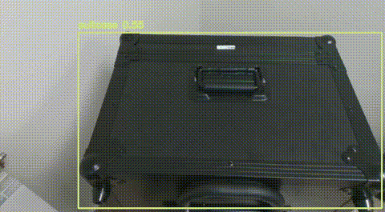
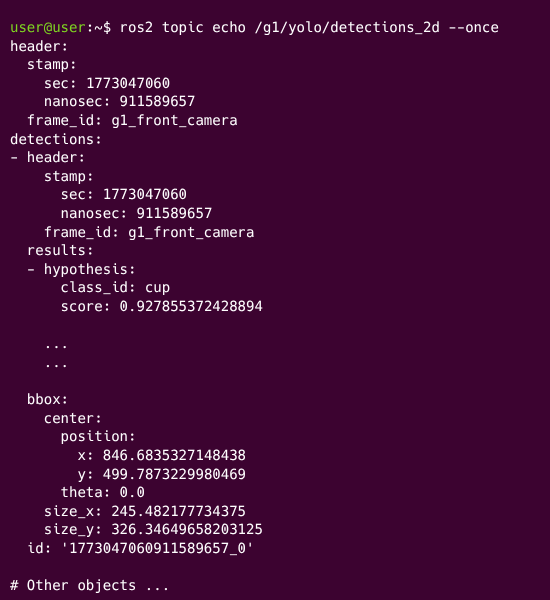

<div align="center">

<h1> YOLO V8 con ROS2 para  Saaki - Unitree G1 </h1>

<p>
  <a href="README.md">English</a> |
  <a href="README_es.md">Español</a>
</p>

[](https://docs.ros.org/en/humble/index.html)
[](https://releases.ubuntu.com/22.04/)
[](https://www.python.org/)
[](https://docs.ultralytics.com/models/yolov8/)
[](https://developer.nvidia.com/cuda/toolkit)

[](https://www.ultralytics.com/)
[](#-real-g1-robot)
[](#execution-and-verification)

[](LICENSE)
</div>

| Vista del Robot | Ejemplo de Salida en Terminal |
|:---:|:---:|
|  |  |

## 📖 Descripción

Este repositorio es un paquete ROS 2 para detección de objetos en el **Unitree G1** usando YOLO sobre el canal oficial de cámara del robot (`videohub`).

Publica detecciones en formato estándar de visión ROS (`vision_msgs/Detection2DArray`) y, de forma opcional, imagen anotada y salida JSON legacy.

**Créditos y origen:** este paquete se integra con la capa oficial de mensajes de Unitree (`unitree_api`, `unitree_go`, `unitree_hg`) y está preparado para trabajar sobre `unitree_ros2`.

Flujo funcional:

1. Envía requests a `/api/videohub/request` (`api_id=1001`).
2. Recibe JPEG en `/api/videohub/response`.
3. Decodifica frame con OpenCV.
4. Ejecuta YOLO (`ultralytics`).
5. Publica:
   - `/g1/yolo/detections_2d` (`vision_msgs/msg/Detection2DArray`)
   - `/g1/yolo/annotated_image` (`sensor_msgs/msg/Image`, opcional)
   - `/g1/yolo/detections` (`std_msgs/msg/String`, opcional JSON)

Notas de diseño:

- Solo hay **una request en vuelo** para evitar backlog.
- Tiene timeout de request (`request_timeout_sec`) con recuperación automática.
- `device=auto` usa `cuda:0` si hay GPU disponible; si no, `cpu`.
- No depende de `realsense-ros`.

---

## 🛠️ Requisitos previos

- Ubuntu 22.04
- ROS 2 Humble
- Robot Unitree G1 conectado por Ethernet
- Underlay de Unitree operativo (`~/unitree_ros2/setup.sh`)

Dependencias de sistema:

```bash
sudo apt update
sudo apt install -y \
  ros-humble-vision-msgs \
  python3-opencv \
  python3-numpy
```

Dependencias Python:

```bash
pip install ultralytics
```

---

## 📦 1. Instalación Base (Dependencias de Unitree)

Dado que este paquete depende de los mensajes oficiales del robot (`unitree_go`, `unitree_hg`, `unitree_api`), **es obligatorio** instalar y compilar el repositorio oficial de Unitree como capa base ("underlay") antes de compilar este repositorio.

### 1.1. Instalar CycloneDDS

El robot se comunica a través de CycloneDDS. En ROS 2 Humble, basta con instalar los binarios del sistema:

```bash
sudo apt install ros-humble-rmw-cyclonedds-cpp ros-humble-rosidl-generator-dds-idl libyaml-cpp-dev
```

### 1.2. Clonar y compilar los mensajes oficiales
No es necesario compilar todo el repositorio de Unitree, solo su espacio de trabajo de CycloneDDS:

```bash
# Clonar el repositorio oficial en tu directorio home (usa nuestro fork)
git clone https://github.com/UAI-BIOARABA/unitree_ros2

# Compilar los paquetes de mensajes
cd ~/unitree_ros2/cyclonedds_ws
colcon build
```

---

## 🎁 2. Instalación y compilación de este repositorio

Desde tu workspace:

```bash
cd ~/ros2_ws/src
# Clonar este repositorio (le ponemos '_' en vez de '-' por estandares de ROS2)
git clone https://github.com/UAI-BIOARABA/saaki-ros2-yolo.git saaki_ros2_yolo
# Ir a la raíz del workspace
cd ~/ros2_ws
source /opt/ros/humble/setup.bash
source ~/unitree_ros2/setup.sh
colcon build --packages-select saaki_ros2_yolo
source ~/ros2_ws/install/setup.bash
```

---

## 🌐 3. Configuración de Red (Conexión al Robot)

Para que ROS 2 descubra al robot, tu PC debe estar en la misma subred y usar CycloneDDS correctamente.

### 1. Conecta el PC al robot mediante cable Ethernet.

### 2. Configura una IP estática en tu PC:

   - IP: 192.168.123.99

   - Máscara: 255.255.255.0

### 3. Edita el script de configuración oficial (~/unitree_ros2/setup.sh). Debe quedar algo así (cambia enp44s0 por el nombre de tu interfaz de red):

```sh
#!/bin/bash
echo "Setup unitree ros2 environment"
source /opt/ros/humble/setup.bash
source $HOME/unitree_ros2/cyclonedds_ws/install/setup.bash
export RMW_IMPLEMENTATION=rmw_cyclonedds_cpp
export CYCLONEDDS_URI='<CycloneDDS><Domain><General><Interfaces>
                            <NetworkInterface name="enp44s0" priority="default" multicast="default" />
                        </Interfaces></General></Domain></CycloneDDS>'
```

---

<a id="ejecucion-y-verificacion"></a>

## 🚀 4. Ejecución y verificación

### Terminal 1: Lanzar

```bash
source /opt/ros/humble/setup.bash
source ~/unitree_ros2/setup.sh
source ~/ros2_ws/install/setup.bash

ros2 launch saaki_ros2_yolo saaki_ros2_yolo.launch.py
```

### Terminal 2: Detecciones (--once para una sola muestra) y frecuencia

```bash
source /opt/ros/humble/setup.bash
source ~/unitree_ros2/setup.sh
source ~/ros2_ws/install/setup.bash

ros2 topic echo /g1/yolo/detections_2d --once
```

Salida JSON legacy:

```bash
ros2 topic echo /g1/yolo/detections --once
```

Frecuencia:

```bash
ros2 topic hz /g1/yolo/detections_2d
```

### Terminal 3: Visualización

```bash
source /opt/ros/humble/setup.bash
source ~/unitree_ros2/setup.sh
source ~/ros2_ws/install/setup.bash

rviz2
```

Ve a add -> by topic -> g1/yolo/annotated_image -> image.

Es posible que `rqt_image_view` vaya demasiado lento, por eso usamos RViz2.

---

## 💡 Tópicos del paquete

Entrada:

- `/api/videohub/request` (`unitree_api/msg/Request`)
- `/api/videohub/response` (`unitree_api/msg/Response`)

Salida:

- `/g1/yolo/detections_2d` (`vision_msgs/msg/Detection2DArray`)
- `/g1/yolo/annotated_image` (`sensor_msgs/msg/Image`)
- `/g1/yolo/detections` (`std_msgs/msg/String`)

---

## 🎛️ Parámetros

### Comunicación y captura

| Parámetro | Default | Descripción |
| --- | --- | --- |
| `request_topic` | `/api/videohub/request` | Topic de request de frame |
| `response_topic` | `/api/videohub/response` | Topic de respuesta con JPEG |
| `video_api_id` | `1001` | API ID de videohub |
| `request_timeout_sec` | `0.5` | Timeout de request en vuelo |
| `target_fps` | `15.0` | Objetivo de captura/inferencia |
| `frame_id` | `g1_front_camera` | `frame_id` de mensajes publicados |

### Salidas

| Parámetro | Default | Descripción |
| --- | --- | --- |
| `detections_topic` | `/g1/yolo/detections_2d` | Topic principal de detección |
| `annotated_image_topic` | `/g1/yolo/annotated_image` | Topic de imagen anotada |
| `publish_annotated_image` | `true` | Activa/desactiva imagen anotada |
| `annotated_image_max_fps` | `15.0` | Límite de FPS de imagen anotada (`0.0` sin límite) |
| `annotated_image_scale` | `0.33` | Escala de imagen anotada |
| `publish_legacy_json` | `true` | Activa salida JSON legacy |
| `legacy_detections_topic` | `/g1/yolo/detections` | Topic JSON legacy |

### Modelo YOLO

| Parámetro | Default | Descripción |
| --- | --- | --- |
| `model_path` | `yolov8n.pt` | Modelo YOLO (`.pt` o nombre) |
| `device` | `auto` | `auto`, `cpu`, `cuda:0`, etc. |
| `conf_threshold` | `0.25` | Umbral de confianza |
| `iou_threshold` | `0.45` | Umbral IoU para NMS |
| `max_detections` | `50` | Máximo de detecciones por frame |

---

## ⚠️ Solución de problemas

`vision_msgs` no instalado:

```bash
sudo apt install ros-humble-vision-msgs
```

`ultralytics` no instalado:

```bash
pip install ultralytics
```

No llegan frames o no hay detecciones:

- Verifica `/ros_bridge`.
- Verifica `/api/videohub/request` y `/api/videohub/response`.
- Comprueba que hiciste `source ~/unitree_ros2/setup.sh`.
- Comprueba red (misma subred, interfaz correcta en CycloneDDS).

Imagen anotada lenta:

- Baja `annotated_image_scale` (`0.33 -> 0.25`).
- Mantén `annotated_image_max_fps` entre `10` y `15`.
- Si priorizas inferencia, desactiva imagen anotada.

---

## 🧑‍💻 Autores

- **Project Manager:** [Juan Fernández](https://github.com/jfbioaraba)
- **Lead Developer:** [Andoni González](https://github.com/andoni92)

---
## Discla<div align="center">

<h1> Detección con YOLO y ROS2 para  Saaki - Unitree G1 </h1>

[](https://docs.ros.org/en/humble/index.html)
[](https://releases.ubuntu.com/22.04/)
[](https://www.python.org/)
[](https://docs.ultralytics.com/models/yolov8/)
[](https://developer.nvidia.com/cuda/toolkit)

[](https://www.ultralytics.com/)
[](#-real-g1-robot)
[](#ejecucion-y-verificacion)

[](LICENSE)
</div>


## 📖 Descripción

Este repositorio es un paquete ROS 2 para detección de objetos en el **Unitree G1** usando YOLO sobre el canal oficial de cámara del robot (`videohub`).

Publica detecciones en formato estándar de visión ROS (`vision_msgs/Detection2DArray`) y, de forma opcional, imagen anotada y salida JSON legacy.

**Créditos y origen:** este paquete se integra con la capa oficial de mensajes de Unitree (`unitree_api`, `unitree_go`, `unitree_hg`) y está preparado para trabajar sobre `unitree_ros2`.

Flujo funcional:

1. Envía requests a `/api/videohub/request` (`api_id=1001`).
2. Recibe JPEG en `/api/videohub/response`.
3. Decodifica frame con OpenCV.
4. Ejecuta YOLO (`ultralytics`).
5. Publica:
   - `/g1/yolo/detections_2d` (`vision_msgs/msg/Detection2DArray`)
   - `/g1/yolo/annotated_image` (`sensor_msgs/msg/Image`, opcional)
   - `/g1/yolo/detections` (`std_msgs/msg/String`, opcional JSON)

Notas de diseño:

- Solo hay **una request en vuelo** para evitar backlog.
- Tiene timeout de request (`request_timeout_sec`) con recuperación automática.
- `device=auto` usa `cuda:0` si hay GPU disponible; si no, `cpu`.
- No depende de `realsense-ros`.

---

## 🛠️ Requisitos previos

- Ubuntu 22.04
- ROS 2 Humble
- Robot Unitree G1 conectado por Ethernet
- Underlay de Unitree operativo (`~/unitree_ros2/setup.sh`)

Dependencias de sistema:

```bash
sudo apt update
sudo apt install -y \
  ros-humble-vision-msgs \
  python3-opencv \
  python3-numpy
```

Dependencias Python:

```bash
pip install ultralytics
```

---

## 📦 1. Instalación Base (Dependencias de Unitree)

Dado que este paquete depende de los mensajes oficiales del robot (`unitree_go`, `unitree_hg`, `unitree_api`), **es obligatorio** instalar y compilar el repositorio oficial de Unitree como capa base ("underlay") antes de compilar este repositorio.

### 1.1. Instalar CycloneDDS

El robot se comunica a través de CycloneDDS. En ROS 2 Humble, basta con instalar los binarios del sistema:

```bash
sudo apt install ros-humble-rmw-cyclonedds-cpp ros-humble-rosidl-generator-dds-idl libyaml-cpp-dev
```

### 1.2. Clonar y compilar los mensajes oficiales
No es necesario compilar todo el repositorio de Unitree, solo su espacio de trabajo de CycloneDDS:

```bash
# Clonar el repositorio oficial en tu directorio home (usa nuestro fork)
git clone https://github.com/UAI-BIOARABA/unitree_ros2

# Compilar los paquetes de mensajes
cd ~/unitree_ros2/cyclonedds_ws
colcon build
```

---

## 🎁 2. Instalación y compilación de este repositorio

Desde tu workspace:

```bash
cd ~/ros2_ws/src
# Clonar este repositorio (le ponemos '_' en vez de '-' por estandares de ROS2)
git clone https://github.com/UAI-BIOARABA/saaki-ros2-yolo.git saaki_ros2_yolo
# Ir a la raíz del workspace
cd ~/ros2_ws
source /opt/ros/humble/setup.bash
source ~/unitree_ros2/setup.sh
colcon build --packages-select saaki_ros2_yolo
source ~/ros2_ws/install/setup.bash
```

---

## 🌐 3. Configuración de Red (Conexión al Robot)

Para que ROS 2 descubra al robot, tu PC debe estar en la misma subred y usar CycloneDDS correctamente.

### 1. Conecta el PC al robot mediante cable Ethernet.

### 2. Configura una IP estática en tu PC:

   - IP: 192.168.123.99

   - Máscara: 255.255.255.0

### 3. Edita el script de configuración oficial (~/unitree_ros2/setup.sh). Debe quedar algo así (cambia enp44s0 por el nombre de tu interfaz de red):

```sh
#!/bin/bash
echo "Setup unitree ros2 environment"
source /opt/ros/humble/setup.bash
source $HOME/unitree_ros2/cyclonedds_ws/install/setup.bash
export RMW_IMPLEMENTATION=rmw_cyclonedds_cpp
export CYCLONEDDS_URI='<CycloneDDS><Domain><General><Interfaces>
                            <NetworkInterface name="enp44s0" priority="default" multicast="default" />
                        </Interfaces></General></Domain></CycloneDDS>'
```

---

<a id="ejecucion-y-verificacion"></a>

## 🚀 4. Ejecución y verificación

### Terminal 1: Lanzar

```bash
source /opt/ros/humble/setup.bash
source ~/unitree_ros2/setup.sh
source ~/ros2_ws/install/setup.bash

ros2 launch saaki_ros2_yolo saaki_ros2_yolo.launch.py
```

### Terminal 2: Detecciones (--once para una sola muestra) y frecuencia

```bash
source /opt/ros/humble/setup.bash
source ~/unitree_ros2/setup.sh
source ~/ros2_ws/install/setup.bash

ros2 topic echo /g1/yolo/detections_2d --once
```

Salida JSON legacy:

```bash
ros2 topic echo /g1/yolo/detections --once
```

Frecuencia:

```bash
ros2 topic hz /g1/yolo/detections_2d
```

### Terminal 3: Visualización

```bash
source /opt/ros/humble/setup.bash
source ~/unitree_ros2/setup.sh
source ~/ros2_ws/install/setup.bash

rviz2
```

Ve a add -> by topic -> g1/yolo/annotated_image -> image.

Es posible que `rqt_image_view` vaya demasiado lento, por eso usamos RViz2.

---

## 💡 Tópicos del paquete

Entrada:

- `/api/videohub/request` (`unitree_api/msg/Request`)
- `/api/videohub/response` (`unitree_api/msg/Response`)

Salida:

- `/g1/yolo/detections_2d` (`vision_msgs/msg/Detection2DArray`)
- `/g1/yolo/annotated_image` (`sensor_msgs/msg/Image`)
- `/g1/yolo/detections` (`std_msgs/msg/String`)

---

## 🎛️ Parámetros

### Comunicación y captura

| Parámetro | Default | Descripción |
| --- | --- | --- |
| `request_topic` | `/api/videohub/request` | Topic de request de frame |
| `response_topic` | `/api/videohub/response` | Topic de respuesta con JPEG |
| `video_api_id` | `1001` | API ID de videohub |
| `request_timeout_sec` | `0.5` | Timeout de request en vuelo |
| `target_fps` | `15.0` | Objetivo de captura/inferencia |
| `frame_id` | `g1_front_camera` | `frame_id` de mensajes publicados |

### Salidas

| Parámetro | Default | Descripción |
| --- | --- | --- |
| `detections_topic` | `/g1/yolo/detections_2d` | Topic principal de detección |
| `annotated_image_topic` | `/g1/yolo/annotated_image` | Topic de imagen anotada |
| `publish_annotated_image` | `true` | Activa/desactiva imagen anotada |
| `annotated_image_max_fps` | `15.0` | Límite de FPS de imagen anotada (`0.0` sin límite) |
| `annotated_image_scale` | `0.33` | Escala de imagen anotada |
| `publish_legacy_json` | `true` | Activa salida JSON legacy |
| `legacy_detections_topic` | `/g1/yolo/detections` | Topic JSON legacy |

### Modelo YOLO

| Parámetro | Default | Descripción |
| --- | --- | --- |
| `model_path` | `yolov8n.pt` | Modelo YOLO (`.pt` o nombre) |
| `device` | `auto` | `auto`, `cpu`, `cuda:0`, etc. |
| `conf_threshold` | `0.25` | Umbral de confianza |
| `iou_threshold` | `0.45` | Umbral IoU para NMS |
| `max_detections` | `50` | Máximo de detecciones por frame |

---

## ⚠️ Solución de problemas

`vision_msgs` no instalado:

```bash
sudo apt install ros-humble-vision-msgs
```

`ultralytics` no instalado:

```bash
pip install ultralytics
```

No llegan frames o no hay detecciones:

- Verifica `/ros_bridge`.
- Verifica `/api/videohub/request` y `/api/videohub/response`.
- Comprueba que hiciste `source ~/unitree_ros2/setup.sh`.
- Comprueba red (misma subred, interfaz correcta en CycloneDDS).

Imagen anotada lenta:

- Baja `annotated_image_scale` (`0.33 -> 0.25`).
- Mantén `annotated_image_max_fps` entre `10` y `15`.
- Si priorizas inferencia, desactiva imagen anotada.

---

## 🧑‍💻 Autores

- **Project Manager:** [Juan Fernández](https://github.com/jfbioaraba)
- **Lead Developer:** [Andoni González](https://github.com/andoni92)

---

## Descargo de responsabilidad

Este software y los materiales asociados se proporcionan “tal cual”, sin garantías de ningún tipo, ni expresas ni implícitas, incluyendo —pero no limitándose a— garantías de comercialización, idoneidad para un propósito particular o ausencia de errores.

Los/as autores/as y Bioaraba – Instituto de Investigación Sanitaria no asumen responsabilidad alguna por el uso, la redistribución o la modificación de este repositorio ni por los posibles daños directos o indirectos derivados de su utilización.

Este proyecto tiene fines exclusivos de investigación y/o docencia.

imer

Este software y los materiales asociados se proporcionan “tal cual”, sin garantías de ningún tipo, ni expresas ni implícitas, incluyendo —pero no limitándose a— garantías de comercialización, idoneidad para un propósito particular o ausencia de errores.

Los/as autores/as y Bioaraba – Instituto de Investigación Sanitaria no asumen responsabilidad alguna por el uso, la redistribución o la modificación de este repositorio ni por los posibles daños directos o indirectos derivados de su utilización.

Este proyecto tiene fines exclusivos de investigación y/o docencia.

